# My Flower Garden

## Overview
My Flower Garden will help a user plan and manage the different flowers they plan on planting in the different areas of their yard or garden.  It will let you organize by location and container. It will also access a Plants API from https://perenual.com/ to search for plants or flowers and see some fun facts on those plants.

## User Stories
As a user, I want to...
  - sign up.
  - sign in. 
  - sign out. 
  - create a garden. 
  - update a garden's name and description.
  - create a section within my garden.
  - update a section name.
  - delete a section from my garden.
  - create a container for my planted flowers.
  - assign a container to a section in my garden.
  - set a quantity for my containers so I don't need to create four containers for all my tomato pots.
  - update a container's name, quantity or liner quantity.
  - search for a flower from the plant API by partial name.
  - add a flower to a container with the preferred packaging and quantity.
  - delete a flower from a container.
  - associate multiple types of flower to the same container (e.g, petunias and spike).
  - show an appropriate home page to someone who's not logged in.

## Wireframes

When you first enter the application and have not logged in yet, you will be presented with a home page that includes options to sign up, log in, or search for flowers:

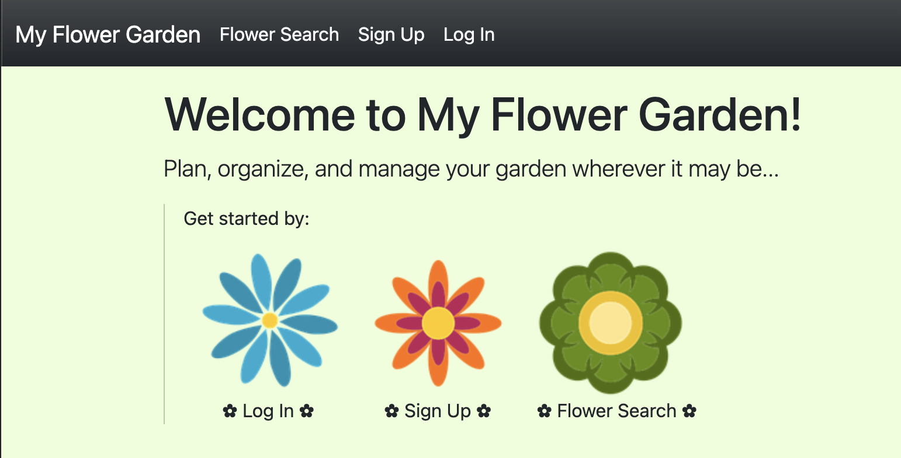

From there, please sign up if you haven't yet done so:

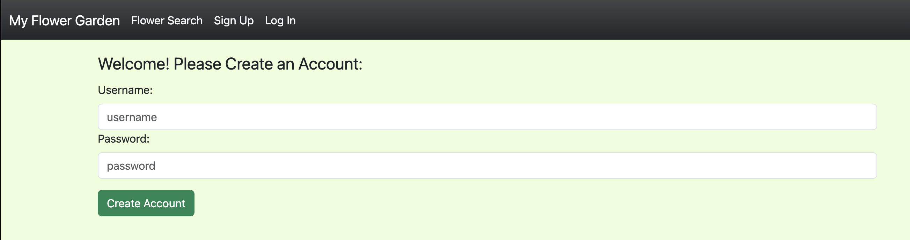

Or log in if you've visited us before:
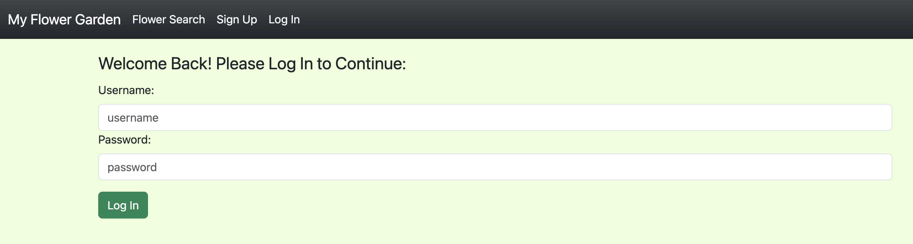

Once logged in, the home page will change to include different options, including view my gardens, search for flowers, or review my favorite flowers:


When you decide to search for flowers to add to your favorites, an external API to Perenual will be called to get matching flowers with their common and scientific names:
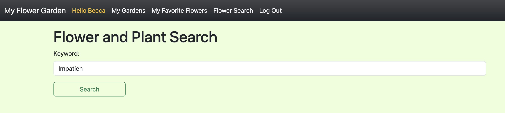

The results will appear as follows, with the ability to save one (or more) as your favorite flower with a name you like to refer to the flower or plant as:
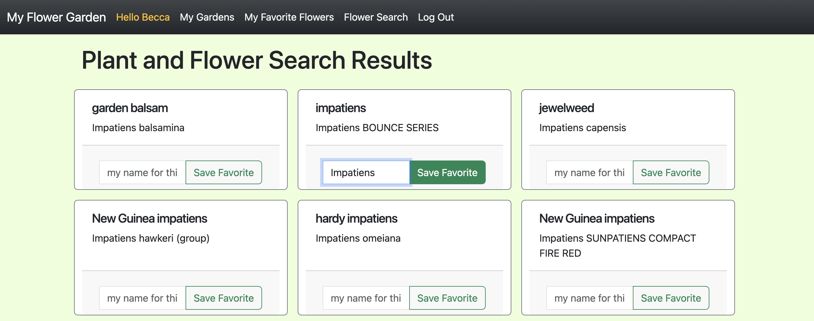

Your favorite flowers can be viewed as well:
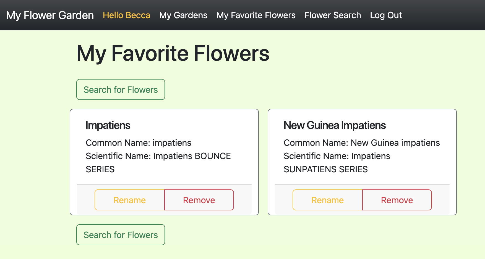

When ready to plan your garden, first create a garden:
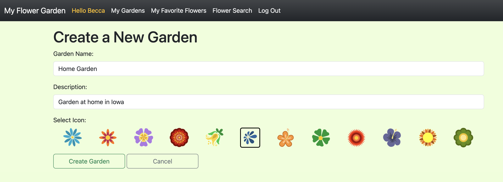

And then see a list of all your gardens, from which you can view details or delete the garden (if no sections have been added):
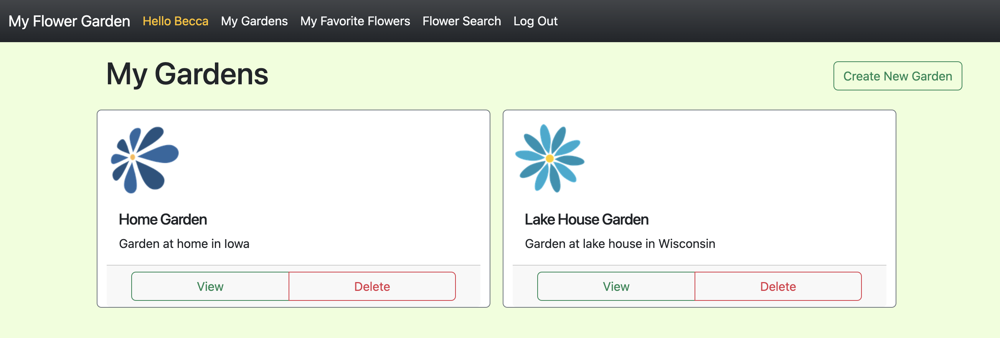

You can divide each garden into multiple sections - say front yard, back yard, by the garage, however your garden is laid out:
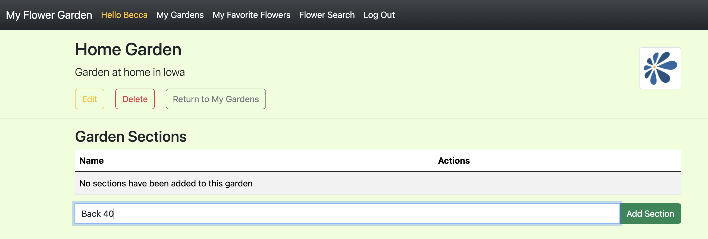

Then see a list of all sections for your garden:
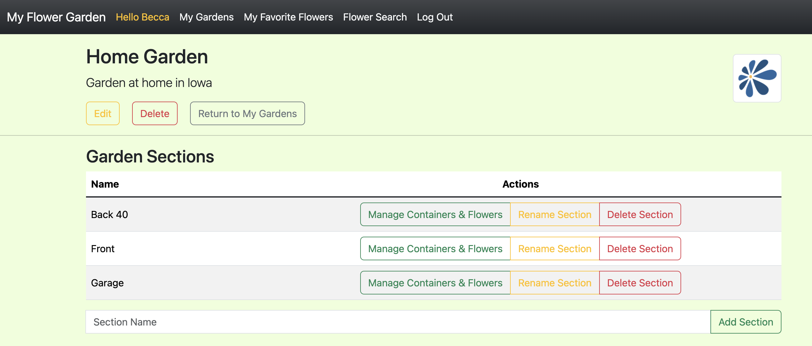

Within a section, you may have multiple containers you want to manage - shepherds hooks, pots, window boxes, anything.  So first you can create the container with a location, quantity (maybe you have two of the same pots - why create two separate containers if you don't have to?), and a liner quantity (if applicable):
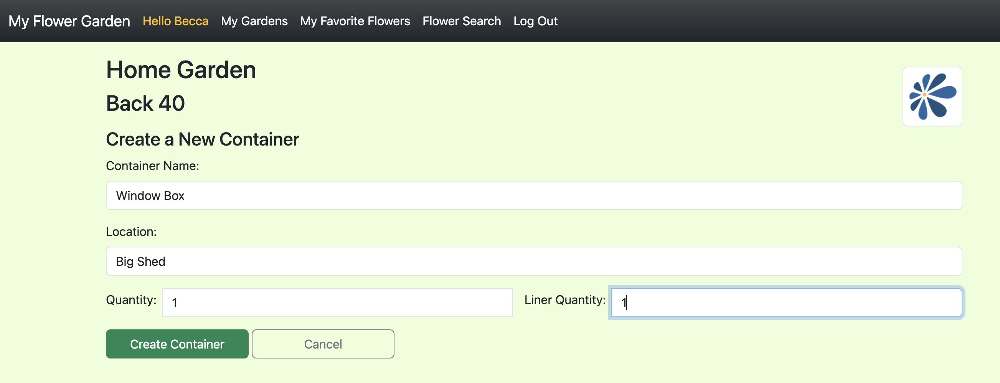

You'll also be able to see all containers in a particular section as you create them:
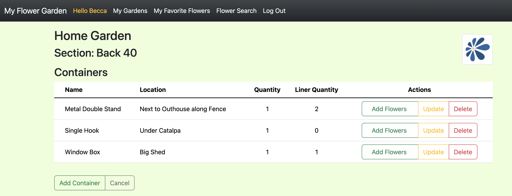

For each container, you are finally at the point you can add flowers to a container from your favorite flowers, along with the quantity, packaging (basket, individual, other):
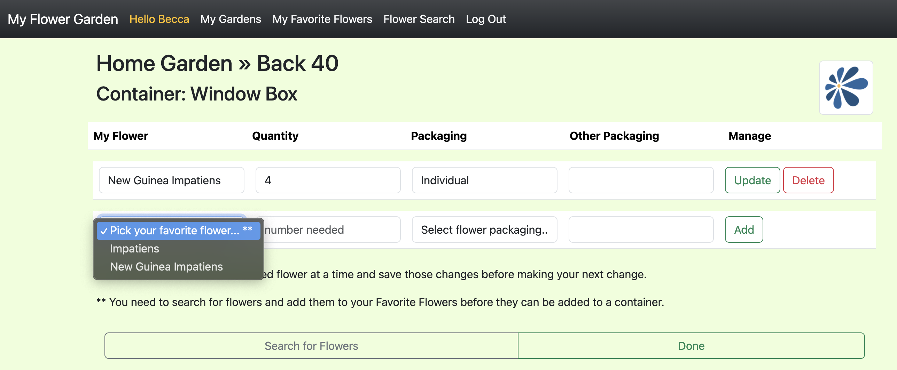

Once you've added flowers to your containers, you'll notice the list of all your containers in a section changes slightly - there is a now a flower icon next to those containers you've added flowers to:
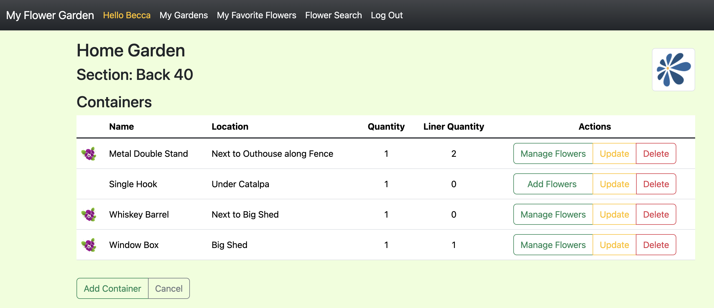

Clicking on that flower icon will expand the table to show the list of flowers in that container, so you can see your entire section at one time if so desired (clicking on the flower icon a second time will collapse the flower details):
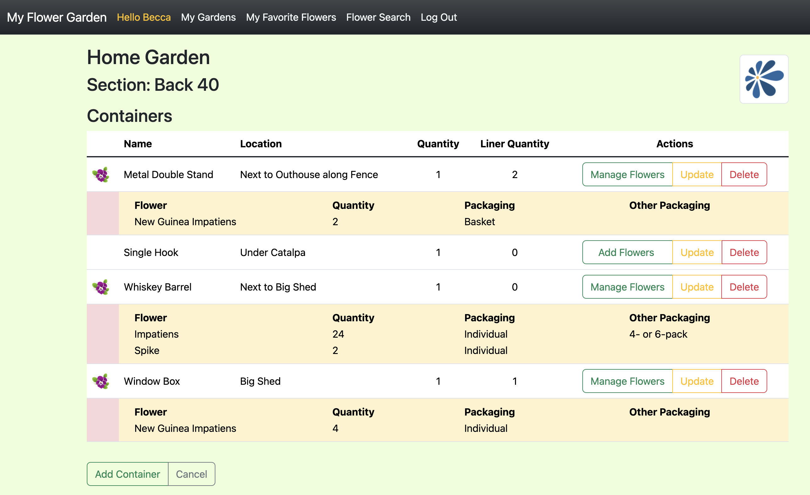

There - your garden is all organized and ready to plant come spring!


## ERD Diagram

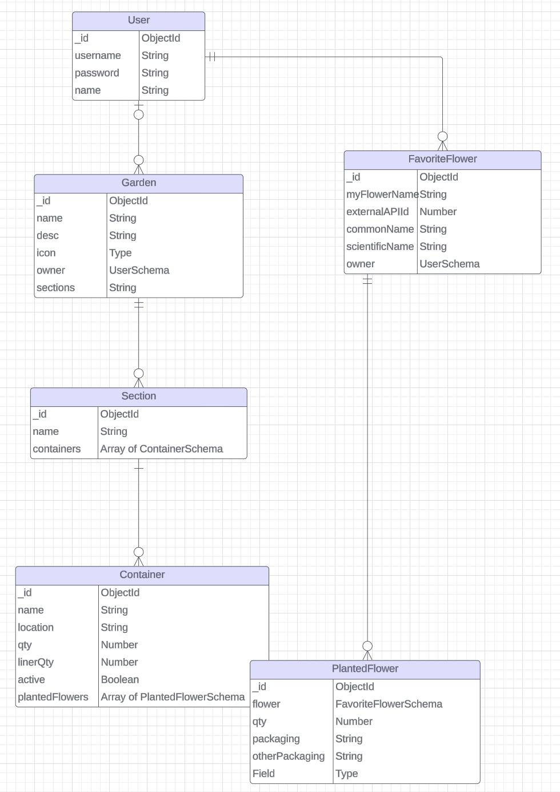

## Technologies Used
- JavaScript
- Node.js
- Express
- EJS
- MongoDB
- CSS3

##### Font
```css
font-family: Arial, Helvetica, sans-serif;
```

## Next Steps
As a user, I want to...
  - delete a garden and all of its sections. 
  - see a shopping list of all the flowers in my garden.
  - search for a flower from the plant API by cycle (e.g., annual, perennial, etc.).
  - upload photos of my containers.
  - inactivate a container so it does not appear on my shopping list.
  - filter container list by active/inactive.
  - change my password.
  - log in with Google.
  - see my errors better.
  - see pictures of the flowers in the search results.
  - see information on the watering and cycle of the flowers in the search results.

