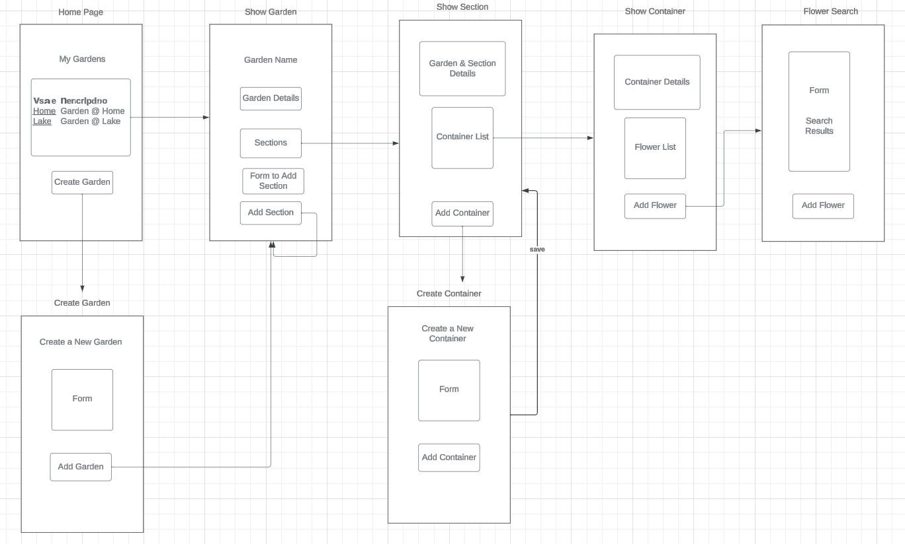
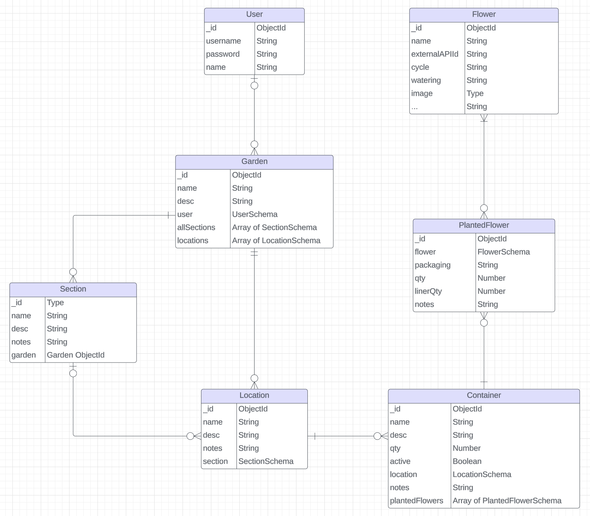

# My Flower Garden

## Overview
My Flower Garden will help a user plan and manage the different flowers they plan on planting in the different areas of their yard or garden.  It will let you organize by location and container. It will also access a Plants API from https://perenual.com/ to search for plants or flowers and see some fun facts on those plants.

## User Stories
As a user, I want to...
  - sign up.
  - sign in. 
  - sign out. 
  - create a garden. 
  - update a garden's name and description.
  - create a location within my garden.
  - update a location's name and description.
  - delete a location from my garden.
  - delete a garden and all of its locations. 
  - create a container for my planted flowers.
  - assign a container to a location in my garden.
  - set a quantity for my containers so I don't need to create four containers for all my tomato pots.
  - search for a flower from the plant API by partial name.
  - associate a flower to a container with the preferred packaging and quantity.
  - delete a flower from a container.
  - associate multiple types of flower to the same container (e.g, petunias and spike).

## Wireframes



## ERD Diagram



## Technologies Used
- JavaScript
- Node.js
- Express
- EJS
- CSS3

##### Font
```css
font-family: Arial, Helvetica, sans-serif;
```

## Next Steps
As a user, I want to...
  - see a shopping list of all the flowers in my garden.
  - search for a flower from the plant API by cycle (e.g., annual, perennial, etc.).
  - divide my garden into sections to better group locations.
  - assign a location to a section.
  - update a section's name and description.
  - delete a section that's not associated to any locations.
  - delete all sections for a garden when the garden is deleted.
  - upload photos of my containers.
  - inactivate a container so it does not appear on my shopping list.
  - filter container list by active/inactive.
  - change my password.
  - log in with Google.
  - see my errors better.

